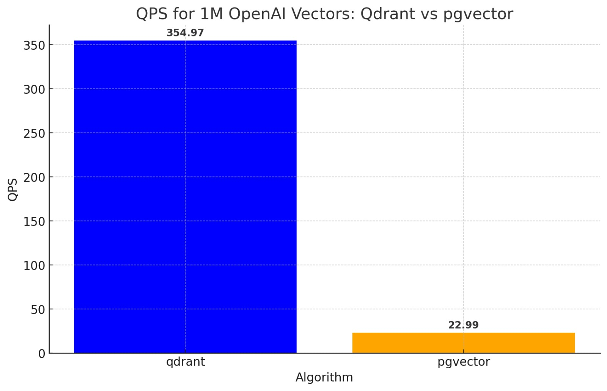
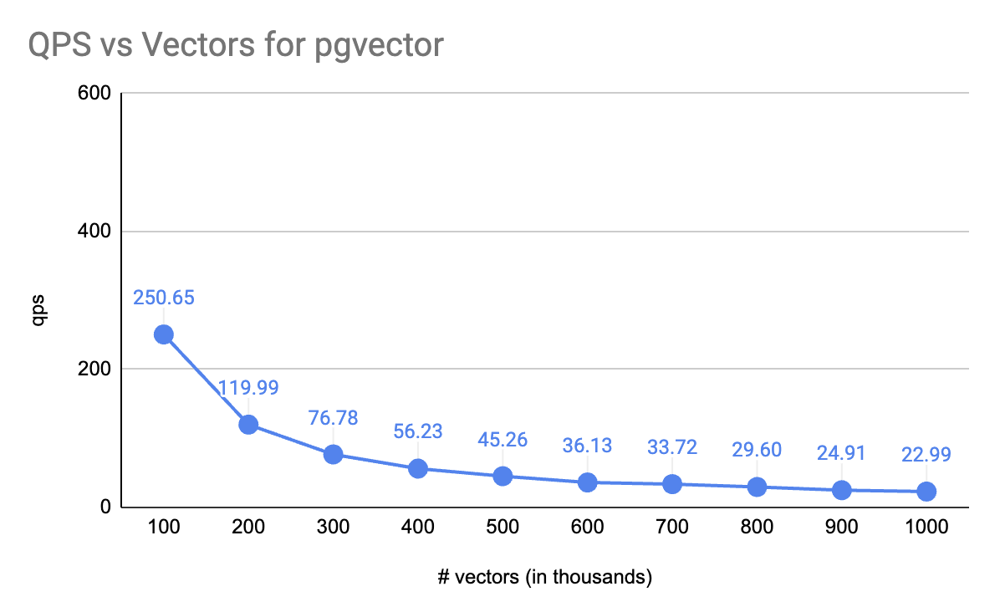
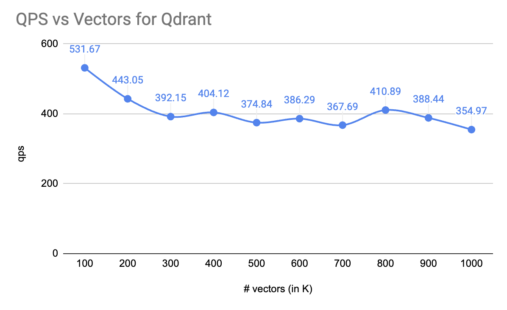

# The Ultimate Guide to VectorDB

Your one-stop resource for decision-making and working with VectorDBs aka Vector Databases, Vector Search Engines

Coming from the Accel talk? [Deck is here](https://bit.ly/ragvectordb)

## 1M OpenAI Benchmark: pgvector vs VectorDB (Qdrant)

### Why You Should Think Twice Before Using pgvector for Production

If you're considering pgvector, for your production environment, you may want to reconsider. 

Our benchmark informs that pgvector lags behind a robust vector database like Qdrant by a factor of 20 when it comes to throughput e.g Queries per second. 

Indeed, that's a 2000% speed deficit! But speed isn't the only metric to consider when evaluating a database; accuracy is just as crucial. Regrettably, pgvector falls short here too, delivering a disappointing 18% fewer relevant documents than Qdrant.

Interestingly, these disparities start to surface with as few as 100,000 chunked documents. 

As an ardent supporter of Postgres, it is disheartening to witness that pgvector doesn't just commence at under half the queries per second (QPS) at 100,000 vectors when compared to Qdrant - it plunges precipitously beyond that. 

One might try to rationalize this by assuming that, albeit slow, Postgres is more accurate? Unfortunately, this is a misconception. Our data reveals that pgvector is not just slower, but also ~18% less accurate!

Latency provides another important lens through which to evaluate these platforms. In this category too, Qdrant holds its own. The worst p95 latency for Qdrant is 2.85s, a stark contrast to pgvector, whose best p95 latency is a full 4.02s. Even more astonishing, pgvector's worst p95 latency skyrockets to an unbelievable 45.46s.

For the data enthusiasts among us, we have provided a comprehensive Google Sheet that details all the numbers for a more in-depth analysis: [Google Sheet](https://docs.google.com/spreadsheets/d/1t2-tXID2LJCXdLv1JTPQaYhmMs6woOnK7W7nkEuDsUc/edit?usp=sharing)

These surprising revelations are courtesy of Erik Bernhardsson's [ann-benchmarks](https://ann-benchmarks.com) code, with special thanks to Kumar Shivendu for their forked version. 

As we continue to test and compare platforms, our commitment to finding the best possible solutions for our production environments remains unwavering. As it stands, the numbers suggest Qdrant could be the preferable choice over pgvector.

Machine: t3.2xlarge

|Attributes -->     |**Security**                                  |**Streaming Index Option**|**Updates**                       |**Payload Management**                                          |**Pricing**                               |**Performance**|**Developer Experience**                                   |BM25 support|Splade Support|In-built embeddings creation library|Langchain integration|Llama index integration|
|-------------------|----------------------------------------------|--------------------------|----------------------------------|----------------------------------------------------------------|------------------------------------------|---------------|-----------------------------------------------------------|------------|--------------|------------------------------------|---------------------|-----------------------|
|**Vector Database**|                                              |                          |                                  |                                                                |                                          |               |                                                           |            |              |                                    |                     |                       |
|Pinecone           |API key & cloud region needed                 |❌                         |✅                                 |Limited to 40kb text as metadata                                |Based on number of vectors and pods       |TK             |Throttle limit on upserts                                  |            |              |                                    |                     |                       |
|Qdrant             |API key for cloud; no authentication for local|❌                         |✅                                 |Any JSON payload with vector; option to index payloads          |Free (open-source); cloud instance pricing|TK             |No enforced upsert limits; supportive community            |            |              |                                    |                     |                       |
|Weaviate           |API key or OIDC authentication                |✅                         |✅                                 |Based on class and schema definition                            |Based on stored objects, queries, SLA tier|TK             |Initial setup can be time-consuming                        |            |              |                                    |                     |                       |
|FAISS              |No built-in security                          |❌                         |Only with IVF Index on GPU version|No payload management; requires external handling               |Free (open-source)                        |TK             |Learning curve due to lack of update support               |            |              |                                    |                     |                       |
|PG Vector          |Inherits PostgreSQL's security                |❌                         |✅                                 |Embeddings for query payload; others as standard PostgreSQL data|Free (open-source)                        |TK             |Less steep learning curve due to PostgreSQL similarities   |            |              |                                    |                     |                       |
|Redis              |Unclear                                       |Unclear                   |Unclear                           |Supports a broad range of data types                            |Unclear                                   |Unclear        |Widely used; has both open-source and closed-source modules|            |              |                                    |                     |                       |
|Vespa              |                                              |                          |                                  |                                                                |                                          |               |                                                           |            |              |                                    |                     |                       |
|Marqo              |                                              |                          |                                  |                                                                |                                          |               |                                                           |            |              |                                    |                     |                       |

# A Comparative Overview of Vector Databases

When dealing with high-dimensional data or working on tasks such as similarity search, recommendation systems, and so on, vector databases (also known as vector search engines) are essential. These databases are optimized to handle vector data, enabling efficient storage, updates, and retrieval of vectors.

We'll be focusing on:

1. Security
1. Updates
1. Payload Management
1. Cost: Various pricing models e.g., GB vs flat
1. Performance - latency, throughput, RAM, and CPU usage — this is the interesting part and where we started from.

In this post, we'll explore and compare six popular vector management tools: Pinecone, Qdrant, Weaviate, FAISS, PG Vector, and Redis. Let's dive in!

## Pinecone
Pinecone is a vector database that stands out for being web-dev friendly. While it's not primarily designed for text management, it can handle embeddings quite well. However, any text data can be converted to embeddings when sent to Pinecone. The primary query payload Pinecone handles is embeddings. As for the source code, it's closed, which might be a limitation for those seeking customization, privacy, or transparency.

1. Security: To use Pinecone, you need an API key and an environment value. The environment value refers to the Cloud region where your data is stored.
2. Streaming index option: Pinecone does not support streaming indexes.
3. Updates: Pinecone supports updates.
4. Payload Management: Pinecone can handle embeddings and text. However, the text can be stored as a metadata field with each vector in an index, as key-value pairs in a JSON object but is limited to a size of 40kb. If you want to store more text, you will have to store it in a separate database and use the vector ID as a key to retrieve the text.
5. Pricing: Pinecone's pricing can be split into three parts (or pods as Pinecone calls them): s1 - storage optimized, p1 - performance optimized, and p2 - 2nd gen performance. So, if you require more storage, you should go for s1. If you require more throughput, you should opt for p1 or p2. The pricing is based on the number of vectors. It's a pay-as-you-go model based on the hours and the number of pods you require. You can find more details [here](https://www.pinecone.io/pricing/).
6. Performance: *TK Please update this with the actual performance metrics.*
7. Developer Experience: The only issue with Pinecone is that the API specifically asks us to throttle our upserts to about 100 vectors per batch, which can delay processes. However, they do offer an alternative solution using gRPC and streaming upserts, which is a bit more work. You can read more about it [here](https://docs.pinecone.io/docs/performance-tuning).

## Qdrant
Qdrant is a versatile open-source vector database written in Rust, it's a performance first view of the tooling. It handles various query payloads, such as text, embeddings, geospatial information, and other data types compatible with the payload structure. This versatility makes Qdrant a robust and adaptable choice for diverse use cases. However, you must create embeddings externally before insertion or upsertion.

1. Security: Qdrant offers two versions: a local version that can be run using a pre-built Docker image, and a cloud-hosted version available only on AWS (during the beta phase). The cloud version provides an API key and a path to the cloud instance for each cluster. For centralized management, there's an option to use one API key to access all clusters. The local version, however, does not require any authentication.
2. Streaming index option: Qdrant does not currently support streaming indexes.
3. Updates: Qdrant fully supports updates.
4. Payload Management: Qdrant empowers you to store any accompanying information as a JSON payload with the vector. There's also an option to index payloads for improved filtering and querying capabilities. You can read more about this [here](https://qdrant.tech/documentation/payload/#payload-indexing).
5. Pricing: As an open-source tool, Qdrant is free. However, for utilizing the cloud version, you'll need to pay for their managed instance. More details are available [here](https://qdrant.tech/pricing/). A crucial aspect to consider when it comes to pricing is the mode of data (vector or payload) storage and persistence—whether in-memory, on disk, or a hybrid of both. More on this can be found [here](https://qdrant.tech/documentation/storage/). Note: In-memory option pricing could escalate with large volumes of data.
6. Performance: *TK Kindly provide the precise performance metrics for Qdrant.*
7. Developer Experience: Qdrant is still in its early stages, which may account for occasional confusion, like the instance of receiving unrelated error messages while using the cloud variant. Nonetheless, the continuous updates and the supportive community are addressing these issues proactively. The upsert or insert limits are not enforced on the client. The `gRPC` mode is easy to setup for higher throughput.

## Weaviate
Weaviate is an open-source vector database with robust capabilities for handling diverse query payloads, including text, embeddings, and any other data as a blob. It also offers schemas to define structure, which significantly adds to its adaptability across different applications. However, its update capabilities could be more clearly defined.

1. Security: Weaviate can be run both locally using a pre-built Docker image and hosted on the cloud. Two authentication methods are available: 1. Via the API key, and 2. Via OIDC authentication (WCS username & password), with the API key being the recommended method. While it's possible to opt out of authentication, it's not advised due to potential security risks. More details on this can be found [here](https://weaviate.io/developers/weaviate/quickstart/connect#overview).
2. Streaming index option: Weaviate supports streaming indexes through their GraphQL API.
3. Updates: Weaviate supports updates.
4. Payload Management: Weaviate enables you to store any information based on the class and the corresponding schema you define. You can learn more about this [here](https://weaviate.io/developers/weaviate/configuration/schema-configuration). It's worth noting that Weaviate offers automatic schema detection and creation, although manually defining the schema might be advisable if you have a clear understanding of the data to be stored.
5. Pricing: Being open-source, Weaviate is free. However, if you wish to use the cloud version, you'll need to pay for their managed instance or opt for a hybrid approach where you bring their database to your VPC/infrastructure. Detailed pricing information is available [here](https://weaviate.io/pricing/). Pricing is straightforward, dependent on the number of stored objects, the number of queries you make, and the chosen SLA tier based on the criticality of your business.
6. Performance: *Kindly provide the precise performance metrics for Weaviate.*
7. Developer Experience: Initial stages of schema definition and understanding the data structure can take some time. However, once familiarized with this process, Weaviate becomes quite straightforward to use.

## FAISS
FAISS (Facebook AI Similarity Search) is a highly efficient library developed by Facebook AI for similarity search and clustering of high-dimensional vectors. Its capacity for updates depends on the index type in use - flat indices do not support updates, while IVF indices do. FAISS, not being a database, is focused primarily on embeddings and does not offer text management, necessitating external handling of text data. As an open-source library, it provides opportunities for customization and in-depth exploration of its internal workings.

1. Security: Being open-source and designed to run only locally, FAISS does not come with a built-in security mechanism.
2. Streaming index option: FAISS does not support streaming indexes.
3. Updates: Updates are unsupported by FAISS CPU, but FAISS GPU does support updates with an IVF Index.
4. Payload Management: FAISS lacks payload management support, hence it requires external handling, often using a pickled file.
5. Pricing: As an open-source library, FAISS is free to use.
6. Performance: *Kindly provide specific performance metrics for FAISS.*
7. Developer Experience: Despite the lack of update support and payload management in the CPU version, which may steepen the learning curve for some users, FAISS offers a low memory footprint and high throughput, making it a valuable choice for many use cases.

## PG Vector
PG Vector is an extension for PostgreSQL that introduces vector support to this widely used relational database. It allows for updates and provides text management as a core functionality of PostgreSQL. Regarding query payloads, PG Vector is primarily geared towards embeddings, with other data types requiring standard PostgreSQL data management. Being open-source, it allows for customization and comprehensive inspection of the source code. [Benchmarks](https://ann-benchmarks.com/pgvector.html) suggest that it may perform slowly when handling more than 10 queries per second.

1. Security: PG Vector, being an extension of PostgreSQL, inherits PostgreSQL's security mechanisms.
2. Streaming index option: PG Vector does not support streaming indexes.
3. Updates: PG Vector does support updates.
4. Payload Management: PG Vector, as an extension of PostgreSQL, supports embeddings as a query payload. For other data types, they need to be managed as standard PostgreSQL data.
5. Pricing: Being an open-source extension, PG Vector is free to use.
6. Performance: *Please provide accurate performance metrics for PG Vector.*
7. Developer Experience: In contrast to most vector databases, PG Vector's similarity to PostgreSQL in data management means a less steep learning curve. It's one of the most requested vector database options to be included by the developer community in the offerings of various cloud providers.

## Redis
Redis, a widely used in-memory data structure store, serves as a database, cache, and message broker. Vector support is provided through its modules, which remain open source despite the core Redis stack being closed source. It's unclear whether Redis supports updates when dealing with vector data. However, it does offer text management capabilities through metadata and, like Qdrant and Weaviate, can handle a broad range of data types as query payloads, including text and embeddings.

